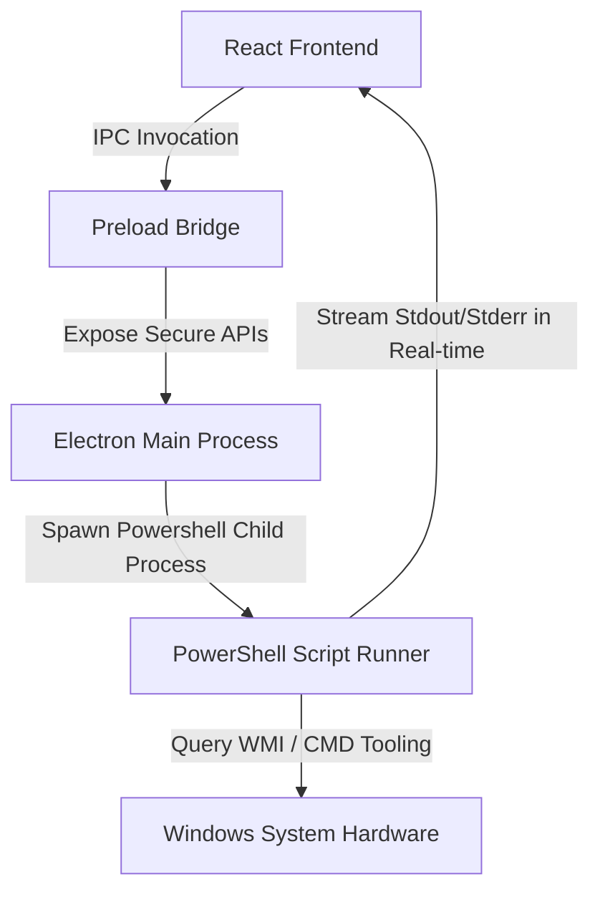

# Solas System Care Pro 🚀
> Professional-grade Advanced System Repair & Driver Management Suite built using React, Electron, Node.js, and native Windows PowerShell scripting.

---

## 🎨 Design & Aesthetic Parameters
* **Theme**: Deep Navy (`#0F172A`), Electric Violet (`#8B5CF6`), and Cyan Accents (`#06B6D4`).
* **Visuals**: Glassmorphic panels, real-time WMI system monitors (CPU, Memory, Disk, and Network Adapter Traffic), and animated status indicators.
* **Flows**: Step-by-step repair orchestrator providing real-time console feedback, progress bars, estimated time remaining, and minimize-to-tray capability during long-running SFC scans.

---

## 🏗️ Core Architecture



---

## 📦 Project Setup & Installation

### Prerequisites
* **Operating System**: Windows 7 SP1, Windows 8, Windows 10, or Windows 11.
* **Node.js**: v18.0.0 or higher.
* **PowerShell**: v3.0 or higher.
* **Administrator Privileges**: Required to execute system repairs, scheduled tasks, and device actions.

### 1. Installation
Clone or navigate to the directory and install dependencies:
```bash
npm install
```

### 2. Development Mode
Run the React Vite dev server and launch the Electron application concurrently:
```bash
# Terminal 1: Start Vite Frontend
npm run dev

# Terminal 2: Start Electron Host
npm run electron:dev
```

### 3. Build & Package (Generate Standalone Portable App)
Compile the React code and package the full application into a standalone Administrator-privileged executable using Electron Builder:
```bash
npm run build
```
The compiled executable will be located inside the `dist-electron/` folder as `SolasSystemCarePro.exe`.

---

## 🛠️ Module Features Mapped to Scripts

| Module | Purpose | Underlying Windows Command / API | Script Location |
| :--- | :--- | :--- | :--- |
| **Dashboard** | Real-time system performance counters | WMI processor loads, physical memory sizes, disk capacity, and network interface traffic speeds | `main.js` (IPC WMI Collector) |
| **Driver Manager** | Hardware diagnostics & PnP resets | signed drivers & PnP Error Codes scan, disable (with registry backup and safe-mode controls), enable, and rollback | `scripts/scan_drivers.ps1`<br>`scripts/repair_driver.ps1` |
| **Software Updater** | Winget upgrades & network self-healing | check winget updates, execute silent installs, atomic DNS adapter backups, Google DNS port 53 testing, and automated restore | `scripts/scan_software_updates.ps1`<br>`scripts/update_software.ps1` |
| **One-Click Care** | Repair orchestrator wizard | WMI system restore point checks, whitelisted file junk previews with 30s undo, active network download monitoring, streamed SFC scans with tray minimization, SSD-only TRIM optimization, and security firewall audits | `scripts/get_drives_info.ps1`<br>`scripts/run_trim.ps1`<br>`scripts/junk_cleanup.ps1`<br>`scripts/network_optimize.ps1`<br>`scripts/create_restore_point.ps1`<br>`scripts/enable_restore.ps1` |
| **Auto-Pilot** | Automated Task Scheduler | Registers weekly SYSTEM-level task scheduler jobs with verification | `scripts/schedule_care.ps1`<br>`scripts/check_task_status.ps1`<br>`scripts/unschedule_care.ps1` |
| **Diagnostics** | Deep crash and battery evaluations | Minidump parsing fallbacks, custom HTML report compiler, powercfg laptop capacity checks, and disk health metrics | `scripts/analyze_bsod.ps1`<br>`scripts/battery_report.ps1`<br>`scripts/disk_health.ps1` |

---

## ⚠️ Administrative Security & Troubleshooting

### Privilege Elevation Loop Prevention
The application checks for Administrator privileges on startup. If missing, it alerts the user and attempts to relaunch with elevated permissions using `Start-Process -Verb RunAs`. To prevent loop conditions (e.g. if the user repeatedly rejects the UAC prompt), a timestamped flag is written to `%TEMP%/solas_relaunch.flag`. If a relaunch is triggered again within 30 seconds, it stops and prompts the user to run the app as Administrator manually.

### PowerShell Execution Policy Bypass
Repairs require running local scripts. If the system's ExecutionPolicy is set to `Restricted`, Solas Care Pro automatically applies `-Scope Process -ExecutionPolicy Bypass` for the running child process. If PowerShell execution is completely disabled via group policy, the app falls back to `cmd.exe` execution paths for critical repair items (such as `sfc /scannow` and network socket resets).

### Restore Point Verification Failures
If Windows System Protection (System Restore) is disabled on drive C:, the restore stage will fail. Users will be prompted with a warning and a `Enable System Protection` button, which runs a script to enable protection on C: and configures a 10% disk limit.

### Compatibility Mode for Windows 7/8
When running under Windows 7 or 8, the app enters a "Compatibility Mode" banner displaying a warning header. CMD fallbacks are automatically utilized for storage cmdlets, and unsupported modern integrations (like Winget) are hidden or deactivated gracefully.
