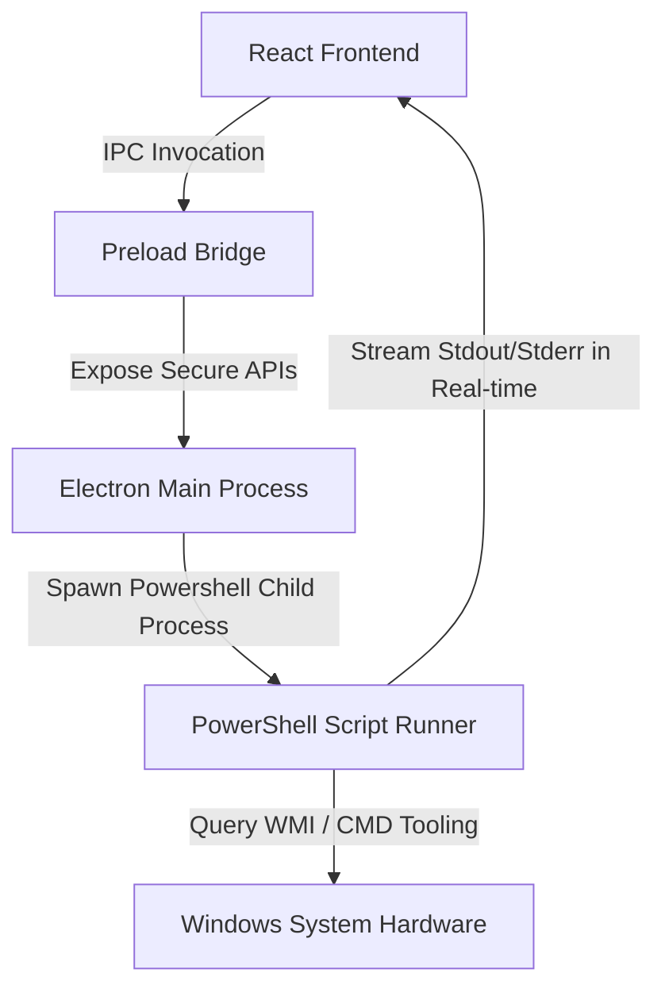

# Solas System Care Pro 🚀
> Professional-grade Advanced System Repair & Driver Management Suite built using React, Electron, Node.js, and native Windows PowerShell scripting.

---

## 🎨 Design & Aesthetic Parameters
* **Theme**: Deep Navy (`#0F172A`), Electric Violet (`#8B5CF6`), and Cyan Accents (`#06B6D4`).
* **Visuals**: Glassmorphic panels, real-time WMI system monitors (CPU, Memory, Disk, and Network Adapter Traffic), and animated status indicators.
* **Flows**: Step-by-step repair orchestrator providing real-time console feedback, progress bars, estimated time remaining, and minimize-to-tray capability during long-running SFC scans.

---

## 🏗️ Core Architecture



---

## 📦 Project Setup & Installation

### Prerequisites
* **Operating System**: Windows 7 SP1, Windows 8, Windows 10, or Windows 11.
* **Node.js**: v18.0.0 or higher.
* **PowerShell**: v3.0 or higher.
* **Administrator Privileges**: Required to execute system repairs, scheduled tasks, and device actions.

### 1. Installation
Clone or navigate to the directory and install dependencies:
```bash
npm install
```

### 2. Development Mode
Run the React Vite dev server and launch the Electron application concurrently:
```bash
# Terminal 1: Start Vite Frontend
npm run dev

# Terminal 2: Start Electron Host
npm run electron:dev
```

### 3. Build & Package (Generate Standalone Portable App)
Compile the React code and package the full application into a standalone Administrator-privileged executable using Electron Builder:
```bash
npm run build
```
The compiled executable will be located inside the `dist-electron/` folder as `SolasSystemCarePro.exe`.

---

## 🛠️ Module Features Mapped to Scripts

| Module | Purpose | Underlying Windows Command / API | Script Location |
| :--- | :--- | :--- | :--- |
| **Dashboard** | Real-time system performance counters | WMI processor loads, physical memory sizes, disk capacity, and network interface traffic speeds | `main.js` (IPC WMI Collector) |
| **Driver Manager** (Enterprise) | Full hardware enumeration, health scanning, backup, install, verification, Windows Update search, report export, remote WinRM ops | WMI/CIM (Win32_PnPSignedDriver, Win32_PnPEntity), PnPUtil, DISM Export-WindowsDriver, Get-AuthenticodeSignature, PE header parsing, Microsoft.Update.Session COM, WinRM/PSRemoting. Auto-creates System Restore points before risky ops. Audit-logged. | `scripts/scan_drivers.ps1`<br>`scripts/driver_health_scan.ps1`<br>`scripts/driver_backup.ps1`<br>`scripts/driver_install.ps1`<br>`scripts/driver_verify.ps1`<br>`scripts/driver_wu_search.ps1`<br>`scripts/driver_report.ps1`<br>`scripts/driver_remote.ps1`<br>`scripts/repair_driver.ps1` (legacy device actions) |
| **Software Updater** | Winget upgrades & network self-healing | check winget updates, execute silent installs, atomic DNS adapter backups, Google DNS port 53 testing, and automated restore | `scripts/scan_software_updates.ps1`<br>`scripts/update_software.ps1` |
| **Smart Repair** | Recipe-driven repair orchestrator | Pre-flight health check, sequenced recipe runner (7 recipes: pc-slow, internet-issues, blue-screen, windows-update-stuck, disk-issues, system-corruption, freshen-windows), per-step CBS/DISM log parsing | `scripts/pre_repair_health_check.ps1`<br>`scripts/parse_cbs_log.ps1`<br>`scripts/parse_dism_log.ps1`<br>`scripts/sfc_custom_scan.ps1`<br>`scripts/dism_custom_source.ps1`<br>`scripts/registry_hive_repair.ps1`<br>`scripts/driver_verifier.ps1`<br>`scripts/safe_mode_repair.ps1`<br>`scripts/repair_summary_report.ps1` |
| **AI Diagnostics** | Rule-based diagnostics + self-heal | Metric collection (RAM/disk/updates/drivers), rule-based findings, recipe recommendations, prediction | `scripts/ai_diagnostics.ps1` |
| **Maintenance Hub** | Junk cleanup + recycle bin | Soft-delete junk with backup + 30s undo window, recycle bin clear | `scripts/junk_cleanup.ps1`<br>`scripts/component_cleanup.ps1` |
| **Report Center** | Repair-summary reports + driver reports | Last 24h audit-log HTML report, plus driver scan HTML/JSON/CSV reports | `scripts/repair_summary_report.ps1`<br>`scripts/driver_report.ps1`<br>`scripts/generate_report.ps1` |

### 🚀 Driver Manager Module (Enterprise)

A complete enterprise-grade driver management system, accessible from the **Drivers** sidebar entry. Single multi-tab UI (no duplicate components):

| Tab | Functionality |
| :--- | :--- |
| **Dashboard** | Health score ring (0-100, color-coded), 6 summary cards (total/healthy/missing/disabled/warnings/unsigned), recent issues timeline |
| **Devices** | Full device grid with status badges, search across name/vendor/HW-ID/PnP-ID, filters (all/problems/missing/unsigned), per-row Update/Disable/Rollback actions |
| **Health Scan** | Quick scan (PnP problem codes + signature status) and Full scan (adds 30-day System event log + SetupAPI log parsing). Categorizes issues into 12 types with severity |
| **Backup** | Full driver backup via DISM `Export-WindowsDriver` + pnputil fallback, with SHA256 manifest verification. List/Verify/Restore/Delete operations. Restore re-installs all INFs from backup |
| **Install** | Single-INF install, folder bulk-install, driver store browser (pnputil /enum-drivers), force-uninstall by OEM INF name. Auto-creates restore point before install/uninstall |
| **Verify** | Authenticode signature, WHQL certification, PE architecture match (x64/ARM64/x86), catalog file validation, OS build compatibility check, SHA256 hash, signer certificate details |
| **Windows Update** | Native WUA COM search for pending driver updates, KB article IDs, install with progress. No third-party driver databases |
| **Reports** | HTML (styled, self-contained), JSON (structured), CSV (RFC 4180 compliant). Saved to `%APPDATA%\SolasCare\reports\` and viewable in Report Center |
| **Remote** | WinRM-based operations: test connection, scan remote drivers, install INF on remote (copies file via admin share), backup drivers on remote. Credentials passed via IPC and cleared from memory |

**Safety features (spec TASK 10):**
- Auto-creates a System Restore point before any install, uninstall, rollback, or backup-restore operation
- All operations are audit-logged to `%APPDATA%\SolasCare\logs\audit.jsonl` (JSONL format with timestamp, user, action, target, result, details)
- All path inputs are validated against injection (`..` traversal, shell metacharacters blocked)
- All PnP device IDs are validated against `^[A-Za-z0-9\\&_.\-{}]+$` regex

---

## ⚠️ Administrative Security & Troubleshooting

### Privilege Elevation Loop Prevention
The application checks for Administrator privileges on startup. If missing, it alerts the user and attempts to relaunch with elevated permissions using `Start-Process -Verb RunAs`. To prevent loop conditions (e.g. if the user repeatedly rejects the UAC prompt), a timestamped flag is written to `%TEMP%/solas_relaunch.flag`. If a relaunch is triggered again within 30 seconds, it stops and prompts the user to run the app as Administrator manually.

### PowerShell Execution Policy Bypass
Repairs require running local scripts. If the system's ExecutionPolicy is set to `Restricted`, Solas Care Pro automatically applies `-Scope Process -ExecutionPolicy Bypass` for the running child process. If PowerShell execution is completely disabled via group policy, the app falls back to `cmd.exe` execution paths for critical repair items (such as `sfc /scannow` and network socket resets).

### Restore Point Verification Failures
If Windows System Protection (System Restore) is disabled on drive C:, the restore stage will fail. Users will be prompted with a warning and a `Enable System Protection` button, which runs a script to enable protection on C: and configures a 10% disk limit.

### Compatibility Mode for Windows 7/8
When running under Windows 7 or 8, the app enters a "Compatibility Mode" banner displaying a warning header. CMD fallbacks are automatically utilized for storage cmdlets, and unsupported modern integrations (like Winget) are hidden or deactivated gracefully.
